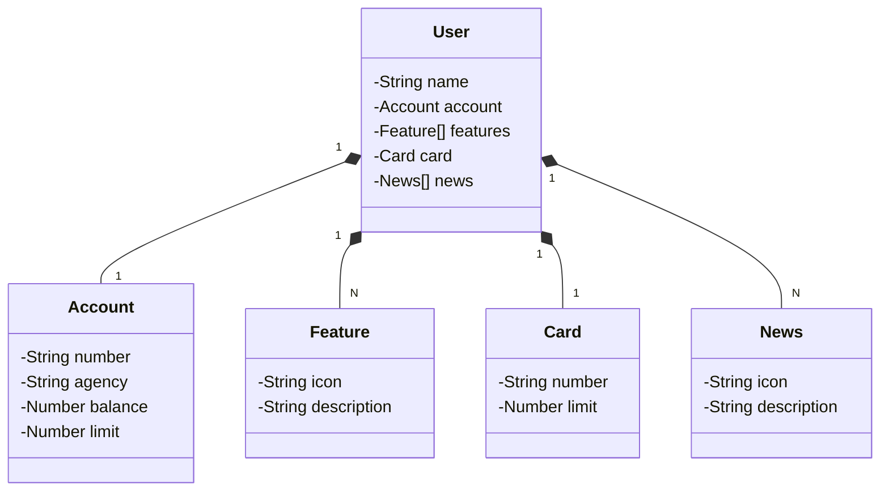

# 📚 Publicando uma API REST na Nuvem com Spring Boot 3 e PostgreSQL

---

## Introdução

🔍 Neste documento, você aprenderá a desenvolver e publicar uma API RESTful usando Spring Boot 3, PostgreSQL, e Java 17, com deploy na nuvem Railway. O projeto será gerenciado com Gradle 7.6.1 e a interface de usuário será desenhada no Figma. Vamos utilizar o VSCode como IDE e o GitHub para controle de versão, seguindo um processo passo a passo.

## Pré-requisitos

- ☕ Java 17
- ⚙️ Gradle 7.6.1
- 💻 VSCode
- 🌐 Conta no GitHub
- ☁️ Conta no Railway
- 📚 Conhecimentos básicos de Spring Boot e PostgreSQL

---

## Configuração do Ambiente

### 📦 Instalação do Java 17

1. Baixe e instale o [Java 17](https://www.oracle.com/java/technologies/javase-jdk17-downloads.html) de acordo com o seu sistema operacional.
2. Verifique a instalação executando `java -version` no terminal.

### ⚙️ Instalação do Gradle 7.6.1

1. Baixe o [Gradle 7.6.1](https://gradle.org/releases/) e siga as instruções de instalação.
2. Confirme a instalação com `gradle -v`.

## 🛠️ Diagrama de Classes (Domínio da API)



## Desenvolvimento

### 📝 Criação do Projeto Spring Boot

1. Acesse o [Spring Initializr](https://start.spring.io/) e configure:
   - Project: **Gradle - Groovy**
   - Language: **Java**
   - Spring Boot: **3.x.x**
   - Dependencies: **Spring Web**, **Spring Data JPA**, **PostgreSQL Driver**
2. Baixe o projeto gerado e abra-o no VSCode.
3. Estruture o projeto em pacotes:
   - `model`: Para as entidades do banco de dados.
   - `repository`: Para interfaces de repositório.
   - `service`: Para a lógica de negócios.
   - `controller`: Para os endpoints REST.

### 🗄️ Implementação do ORM

#### Configuração do acesso às bases de dados:

Adicione as propriedades da base de dados no `application.properties`:

```properties
# Configuração do H2 para o perfil de desenvolvimento
spring.datasource.driverClassName=org.h2.Driver
spring.datasource.username=sa
spring.datasource.password=
spring.datasource.url=jdbc:h2:mem:testdb
spring.jpa.database-platform=org.hibernate.dialect.H2Dialect
spring.h2.console.enabled=true
spring.jpa.show-sql=true

# Configuração do PostgreSQL para o perfil de produção
spring.datasource.url=jdbc:postgresql://localhost:5432/sua_base_de_dados
spring.datasource.driverClassName=org.postgresql.Driver
spring.datasource.username=seu_usuario
spring.datasource.password=sua_senha
spring.jpa.database-platform=org.hibernate.dialect.PostgreSQLDialect
spring.jpa.show-sql=false
```

#### Mapeamento Objeto-Relacional:

1. Crie uma entidade no pacote `model`:

   ```java
   import jakarta.persistence.*;
   import java.util.List;

   @Entity(name = "tb_user")
   public class User {
       @Id
       @GeneratedValue(strategy = GenerationType.IDENTITY)
       private Long id;
       private String name;
       @OneToOne(cascade = CascadeType.ALL)
       private Account account;
       @OneToOne(cascade = CascadeType.ALL)
       private Card card;
       @OneToMany(cascade = CascadeType.ALL, fetch = FetchType.EAGER)
       private List<Feature> features;
       @OneToMany(cascade = CascadeType.ALL, fetch = FetchType.EAGER)
       private List<News> news;
       // Getters e Setters
   }
   ```

2. Crie um repositório no pacote `repository`:

   ```java
   import org.springframework.data.jpa.repository.JpaRepository;
   import org.springframework.stereotype.Repository;

   @Repository
   public interface UserRepository extends JpaRepository<User, Long> {
       boolean existsByAccountNumber(String accountNumber);
   }
   ```

### 🚨 Desenvolvimento da Camada de Exceções

#### Classes de Exceção Personalizadas:

1. Crie uma classe para exceção no pacote `exception`:

   ```java
   public class ResourceNotFoundException extends RuntimeException {
       public ResourceNotFoundException(String message) {
           super(message);
       }
   }
   ```

#### Manipulador Global de Exceções:

1. Crie uma classe no pacote `exception`:

   ```java
   import org.slf4j.Logger;
   import org.slf4j.LoggerFactory;
   import org.springframework.http.HttpStatus;
   import org.springframework.http.ResponseEntity;
   import org.springframework.web.bind.annotation.ExceptionHandler;
   import org.springframework.web.bind.annotation.RestControllerAdvice;
   import java.util.NoSuchElementException;

   @RestControllerAdvice
   public class GlobalExceptionHandler {
       private final Logger logger  = LoggerFactory.getLogger(GlobalExceptionHandler.class);

       @ExceptionHandler(IllegalArgumentException.class)
       public ResponseEntity<String> handleBusinessException(IllegalArgumentException businessException) {
           return new ResponseEntity<>(businessException.getMessage(), HttpStatus.UNPROCESSABLE_ENTITY);
       }

       @ExceptionHandler(NoSuchElementException.class)
       public ResponseEntity<String> handleNotFoundException(NoSuchElementException notFoundException) {
           return new ResponseEntity<>("Resource ID not found.", HttpStatus.NOT_FOUND);
       }

       @ExceptionHandler(Throwable.class)
       public ResponseEntity<String> handleUnexpectedException(Throwable unexpectedException) {
           var message = "Unexpected server error, see the logs.";
           logger.error(message, unexpectedException);
           return new ResponseEntity<>(message, HttpStatus.INTERNAL_SERVER_ERROR);
       }
   }
   ```

### 🎨 Integração com Figma

1. **Design da Interface de Usuário**:
   - Crie uma conta e use o Figma para desenhar a interface da aplicação conforme suas necessidades.

2. **Conversão de Designs Figma em Código**:
   - Implemente o front-end baseado no design do Figma. Utilize frameworks como Thymeleaf ou React se necessário.

---

### ✔️ Execução de Testes com o Gradle

- Execute os testes com o comando selecionando “Run tests”.

---

## Versionamento com GitHub

### 📂 Criação de um Repositório no GitHub

1. No GitHub, crie um novo repositório para o seu projeto.
2. Adicione o repositório remoto ao seu projeto local:

   ```bash
   git remote add origin https://github.com/seu_usuario/seu_repositorio.git
   ```

### 🌿 Uso de Branches e Pull Requests

1. **Criando uma Nova Branch**:

   ```bash
   git checkout -b feature/nova-feature
   ```

2. **Commitando Alterações**:

   ```bash
   git add .
   git commit -m "Implementação da nova feature"
   ```

3. **Subindo a Branch para o GitHub**:

   ```bash
   git push origin feature/nova-feature
   ```

4. **Criando um Pull Request**:
   - No GitHub, abra um Pull Request da sua branch para a `main`.

---

## Deploy na Railway

### ☁️ Configuração do Ambiente Railway

1. Crie uma conta no [Railway](https://railway.app/).
2. Crie um novo projeto e conecte seu repositório GitHub.

### 🔗 Conexão do Repositório GitHub com Railway

1. Conecte o repositório configurado na Railway.
2. Configure as variáveis de ambiente necessárias (como as credenciais do banco de dados).

### 🚀 Deploy da Aplicação

1. Realize o deploy pelo painel do Railway, confirmando que o build está funcionando corretamente.

---

## Conclusão

### ✅ Verificação Final da API na Nuvem

1. Acesse a URL fornecida pelo Railway para verificar a API.
2. Teste os endpoints usando ferramentas como Postman ou Swagger para confirmar que tudo está funcionando conforme o esperado.

## 📎 Anexos

- **Links Úteis**:
  - [Documentação do Spring Boot](https://spring.io/projects/spring-boot)
  - [Documentação do Gradle](https://docs.gradle.org/current/userguide/userguide.html)
  - [Documentação do Railway](https://docs.railway.app/)

**Autor**: Rosane Dias  
**Data**: Julho 2024
