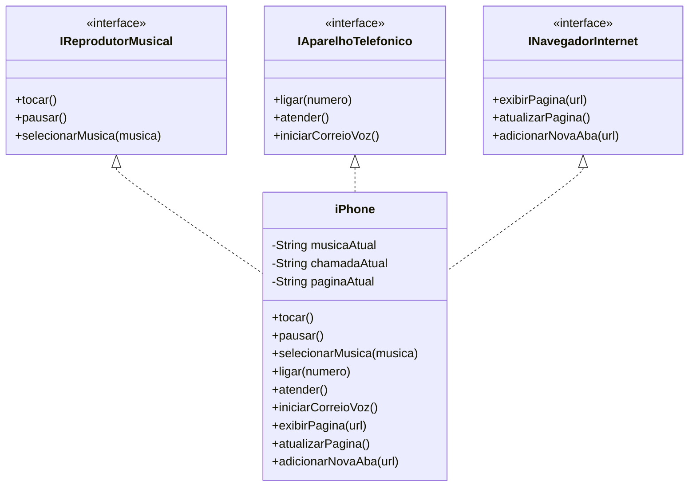

# 📱 Guia Passo a Passo: Modelagem UML para iPhone com Foco em Música, Chamadas e Navegação Web

Este guia foi produzido de forma que desenvolvedores iniciantes possam entender como implementar uma modelagem UML. 
A classe iPhone, conforme análise nessa abstração, abrange as funcionalidades de um Reprodutor Musical 🎵, Aparelho Telefônico 📞 e Navegador na Internet 🌐. 
Vamos detalhar cada passo, desde a análise de requisitos até a implementação em Java, utilizando uma linguagem clara e acessível.

## 📋 Análise de Requisitos Descomplicada

Antes de começarmos a desenhar nossos diagramas UML, precisamos compreender as funcionalidades que queremos modelar:

1. **Reprodutor Musical**:
   - Tocar música: Iniciar a reprodução de uma música.
   - Pausar música: Parar temporariamente a música que está tocando.
   - Selecionar música: Escolher uma música da lista para tocar.

2. **Aparelho Telefônico**:
   - Ligar: Fazer uma chamada para um contato ou número.
   - Atender: Responder a uma chamada recebida.
   - Iniciar Correio de Voz: Acessar mensagens de voz.

3. **Navegador na Internet**:
   - Exibir página: Mostrar o conteúdo de um site.
   - Atualizar página: Recarregar o site para ver novos conteúdos.
   - Adicionar nova aba: Abrir um novo site sem fechar o atual.

Com essas funcionalidades claras, estamos prontos para criar nosso diagrama UML.

## 🖊️ Criação do Diagrama de Classes UML

Para desenhar o Diagrama foi utilizada a ferramenta [Mermaid](https://mermaid-js.github.io/mermaid/#/) gratuitamente. 
Ela é intuitiva, não requer instalação e é compatível com o padrão markdown.

### 🏗️ Construindo o Diagrama de Classes

Diagrama de classes que representa as funcionalidades do iPhone:



### 📝 Abaixo, segue a implementação da representação UML em código Java.

#### 🎼 Interfaces Simplificadas

```java
public interface IReprodutorMusical {
    void tocar();
    void pausar();
    void selecionarMusica(String musica);
}

public interface IAparelhoTelefonico {
    void ligar(String numero);
    void atender();
    void iniciarCorreioVoz();
}

public interface INavegadorInternet {
    void exibirPagina(String url);
    void atualizarPagina();
    void adicionarNovaAba(String url);
}
```

#### 📲 Classe iPhone para Implementação

```java
public class iPhone implements IReprodutorMusical, IAparelhoTelefonico, INavegadorInternet {
    private String musicaAtual;
    private String chamadaAtual;
    private String paginaAtual;

    // Métodos do Reprodutor Musical
    @Override
    public void tocar() {
        System.out.println("Tocando musica");
    }

    @Override
    public void pausar() {
        System.out.println("Pausando musica");
    }

    @Override
    public void selecionarMusica(String musica) {
        System.out.println("Musica selecionada: " + musica);
    }

    // Métodos do Aparelho Telefônico
    @Override
    public void ligar(String numero) {
        chamadaAtual = numero;
        System.out.println("Ligando para o número: " + chamadaAtual);
    }

    @Override
    public void atender() {
        System.out.println("Chamada atendida.");
    }

    @Override
    public void iniciarCorreioVoz() {
        System.out.println("Iniciando correio de voz.");
    }

    // Métodos do Navegador na Internet
    @Override
    public void exibirPagina(String url) {
        paginaAtual = url;
        System.out.println("Exibindo a página: " + paginaAtual);
    }

    @Override
    public void atualizarPagina() {
        System.out.println("Página atualizada.");
    }

    @Override
    public void adicionarNovaAba(String url) {
        System.out.println("Nova aba adicionada na url: " + url);
    }
}
